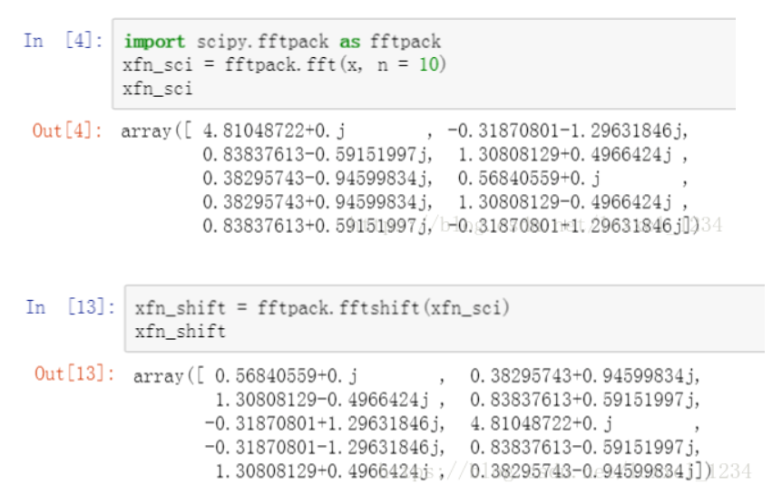

## Fourier transform tutorial

**Intruduction**:

* From 1d to 2d, including the principle and code in python, tell you what is the Fourier transformation.

**Advise**:

* If you are not familar with the math principle of Fourier Transformation, try to see article below. 
* This tutorial is more tended to the code achievement and principle of code in python.

[为什么傅里叶变换可以把时域信号变为频域信号？](https://www.zhihu.com/question/279808864)

[怎么理解虚数和复数？](https://www.zhihu.com/question/46877027)

### 1 Fourier transform in one dimensions discrete interpretation
**Steps**:
* Generate 1000 discrete number which is distributed as 
\+5*\sin(2\pi*300x)\+3*\sin(2\pi*400x))
$y=7*\sin(2\pi*200x)+5*\sin(2\pi*300x)+3*\sin(2\pi*400x)$
* According to the forlumation below to get the frequency/spectrum domain
$$
f(x)=\int_{-\infty}^{\infty}F(k)e^{2\pi ikx}dk\\
F(x)=\int_{-\infty}^{\infty}f(k)e^{-2\pi ikx}dk
$$
* Forlumation above is applied in continuously data. Here, $f(x)$ means the 1000 numbers, and the $F(x)$ means the frequency domain corresponding.
* We can change for discrete one easily like below.
$$
f(x)=\sum_{k=0}^{N-1}F(k)e^{2\pi ikx}\\
F(x)=\sum_{k=0}^{N-1}f(k)e^{-2\pi ikx}\\
$$
* Which has the similar implication.
* Refer to https://blog.csdn.net/qq_27825451/article/details/88553441

### 2 Evaluate the formulation
$$F(x)=\sum_{k=0}^{N-1}f(k)e^{-2\pi ikx/N}\\$$
* According to Euler formulation, which connect the trigonometric and complex domain
$$ e^{ix}=\cos(x)+i\sin(x)$$
* we can divide two parts: compute the real and unreal. Further formulation below:
$$F(x)=\sum_{k=0}^{N-1}f(k)\cos(2\pi kx/N)-if(k)\sin(2\pi kx/N)$$ 
* So with the help of function below, we can know when x=200,300,400, the F(x) equal 
* 6.77,4.62,2.59 corresponding with the coefficient 7,5,3 which exactly confirm the accuracy of fourier transformer

### 3 Inverse Fourier transformer
* inverse test
* remove the 200 and 300 hz frequency
* and then inverse to see what will happen

**TIPS**:
* np.real() to get the real part 
* np.imag() to get the image part

### 4 Fourier transform in two dimensions discrete interpretation
$$
f(x,y)=\sum_{i=0}^{N-1}\sum_{j=0}^{N-1}F(i,j)e^{-2\pi i(\frac{ix}{N}+\frac{jy}{N})}\\
F(x,y)=\sum_{i=0}^{N-1}\sum_{j=0}^{N-1}f(i,j)e^{-2\pi i(\frac{ix}{N}+\frac{jy}{N})}\\
$$
* Actually, if we wanna get the magnitude, we shall multuply the $\frac{1}{N^2}$ in front like below.
$$
F(x,y)=\frac{1}{N^2}\sum_{i=0}^{N-1}\sum_{j=0}^{N-1}f(i,j)e^{-2\pi i(\frac{ix}{N}+\frac{jy}{N})}\\
$$

**TIPS**:
* fftshift:用于将FFT变换之后的频谱显示范围从[0, N]变为：
* [-N/2, N/2-1](N为偶数)或者[-(N-1)/2, (N-1)/2](N为奇数) like below.
* we need fftshift cause we could make task more easily after fftshift deal with. 

* Refer to: https://baishui.blog.csdn.net/article/details/97369061
* https://homepages.inf.ed.ac.uk/rbf/HIPR2/fourier.htm
* https://blog.csdn.net/seekyong/article/details/104434128
